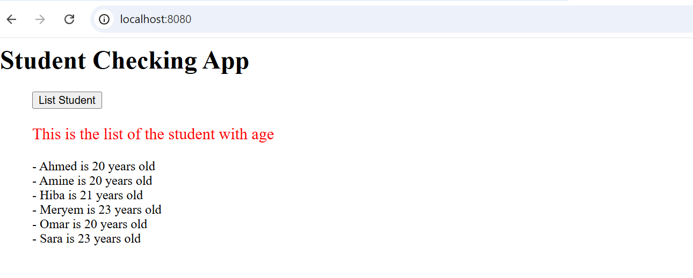
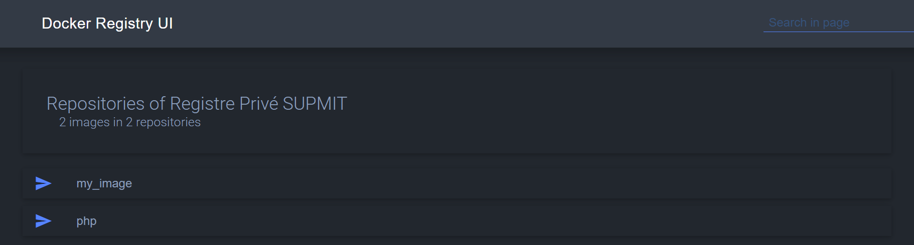

### Creation de l'image

```powershell
PS C:\xampp\htdocs\student_list\simple_api> docker build -t my_image .
[+] Building 139.7s (12/12) FINISHED                                                       docker:desktop-linux
 => [internal] load build definition from Dockerfile                                                       0.1s
 => => transferring dockerfile: 402B                                                                       0.1s 
 => [internal] load metadata for docker.io/library/python:3.8-buster                                       3.4s
 => [auth] library/python:pull token for registry-1.docker.io                                              0.0s
 => [internal] load .dockerignore                                                                          0.1s
 => => transferring context: 2B                                                                            0.0s 
 => [1/6] FROM docker.io/library/python:3.8-buster@sha256:04c3f641c2254c229fd2f704c5199ff4bea57d26c1c290  75.7s 
 => => resolve docker.io/library/python:3.8-buster@sha256:04c3f641c2254c229fd2f704c5199ff4bea57d26c1c2900  0.0s 
 => => sha256:ac8bb7e1a32398e26c129ce64e2ddc3e7ec6c34d93424b247f16049f5a91cff4 50.45MB / 50.45MB          20.0s 
 => => sha256:04c3f641c2254c229fd2f704c5199ff4bea57d26c1c29008ae3a4afddde98709 988B / 988B                 0.0s 
 => => sha256:bc4b9fb034a871b285bea5418cedfcaa9d2ab5590fb5fb6f0c42aaebb2e2c911 2.01kB / 2.01kB             0.0s 
 => => sha256:406c7153026b3565d5558f11c84fb77dff1f2a045c2e9b05dac78a8416050db7 7.56kB / 7.56kB             0.0s 
 => => sha256:b1e7e053c9f6f57c6d95002167a6d57aed6aacf04dd2f8e681cb4f74a7ca4381 51.87MB / 51.87MB          23.0s 
 => => sha256:3b1c264c0ad4598c25048a6dbd3030086cc5c74000e11d04ac27944cb116aabb 17.58MB / 17.58MB           8.3s 
 => => sha256:a2e1e233599c00054fb839db78b4d42e6f12f36b64280aa62d482a3ad0ad7109 191.88MB / 191.88MB        50.4s 
 => => sha256:0ebfe287e9761b9b7dd1703470ff3473a62fe75238f3de01282165f8725968af 6.15MB / 6.15MB            23.5s 
 => => extracting sha256:ac8bb7e1a32398e26c129ce64e2ddc3e7ec6c34d93424b247f16049f5a91cff4                 11.9s 
 => => sha256:819d305a9b2210516eaf5929daf6caa015f1f0ffa8be96252cb05d0f283bfff5 19.29MB / 19.29MB          30.3s 
 => => sha256:a11e135762f00d55e3d68410f1aab593ca9850d9c2ca07f69fb5ac353fc99e0a 243B / 243B                23.9s 
 => => sha256:5e4e21ea7d0468facdec867e65083ff3d90f16a69413e7c2a891b99c13ad8a55 2.85MB / 2.85MB            25.2s 
 => => extracting sha256:3b1c264c0ad4598c25048a6dbd3030086cc5c74000e11d04ac27944cb116aabb                  3.5s 
 => => extracting sha256:b1e7e053c9f6f57c6d95002167a6d57aed6aacf04dd2f8e681cb4f74a7ca4381                 13.4s 
 => => extracting sha256:a2e1e233599c00054fb839db78b4d42e6f12f36b64280aa62d482a3ad0ad7109                 20.7s 
 => => extracting sha256:0ebfe287e9761b9b7dd1703470ff3473a62fe75238f3de01282165f8725968af                  0.8s 
 => => extracting sha256:819d305a9b2210516eaf5929daf6caa015f1f0ffa8be96252cb05d0f283bfff5                  1.6s 
 => => extracting sha256:a11e135762f00d55e3d68410f1aab593ca9850d9c2ca07f69fb5ac353fc99e0a                  0.0s 
 => => extracting sha256:5e4e21ea7d0468facdec867e65083ff3d90f16a69413e7c2a891b99c13ad8a55                  0.7s 
 => [internal] load build context                                                                          0.2s 
 => => transferring context: 1.99kB                                                                        0.1s 
 => [2/6] COPY student_age.py /                                                                            0.3s 
 => [3/6] RUN  apt update -y && apt install python3-dev libsasl2-dev libldap2-dev libssl-dev -y           37.2s 
 => [4/6] COPY requirements.txt /                                                                          0.1s 
 => [5/6] RUN pip3 install -r requirements.txt                                                            20.2s 
 => [6/6] RUN mkdir /data                                                                                  0.7s
 => exporting to image                                                                                     1.6s 
 => => exporting layers                                                                                    1.5s 
 => => writing image sha256:782a1b499dbe1be6a1e44c9b26a413e0ebd55d3e43a085deca22928c2f279777               0.0s 
 => => naming to docker.io/library/my_image                                                                0.0s 
```

### Verification
```powershell
```powershell 
docker images
PS C:\xampp\htdocs\student_list\simple_api> docker images
REPOSITORY                         TAG                 IMAGE ID       CREATED          SIZE
my_image                           latest              782a1b499dbe   42 seconds ago   1.05GB
mongodb/mongodb-community-server   6.0.14-ubuntu2204   a1ee4d6ce0b0   5 days ago       1.19GB
ubuntu                             latest              a04dc4851cbc   7 weeks ago      78.1MB
hello-world                        latest              74cc54e27dc4   8 weeks ago      10.1kB
```
### Creation de container 
```powershell 
docker run --name my_container -p 5000:5000 my_image
PS C:\xampp\htdocs\student_list\simple_api> docker run --name my_container -p 5000:5000 my_image
Traceback (most recent call last):
  File "student_age.py", line 33, in <module>
    student_age_file = open(student_age_file_path, "r")
FileNotFoundError: [Errno 2] No such file or directory: '/data/student_age.json'
```
### Ajout de fichier student_age.student à /data
```powershell
docker cp student_age.json my_container:/data 
PS C:\xampp\htdocs\student_list\simple_api> docker cp student_age.json my_container:/data
Successfully copied 2.05kB to my_container:/data
```
### démarrer le conteneur à nouveau
```powershell
docker start my_container
PS C:\xampp\htdocs\student_list\simple_api> docker start my_container
my_container
```
### Vérifier les logs
```powershell
docker logs my_container
PS C:\xampp\htdocs\student_list\simple_api> docker logs my_container
Traceback (most recent call last):
  File "student_age.py", line 33, in <module>
    student_age_file = open(student_age_file_path, "r")
FileNotFoundError: [Errno 2] No such file or directory: '/data/student_age.json'
 * Serving Flask app 'student_age' (lazy loading)
 * Environment: production
   WARNING: This is a development server. Do not use it in a production deployment.
   Use a production WSGI server instead.
 * Debug mode: on
 * Running on all addresses.
   WARNING: This is a development server. Do not use it in a production deployment.
 * Running on http://172.17.0.2:5000/ (Press CTRL+C to quit)
 * Restarting with stat
 * Debugger is active!
 * Debugger PIN: 141-803-175
```
### test de requete
```bash
curl -u root:root -X GET http://localhost:5000/supmit/api/v1.0/get_student_ages
_student_ages
{
  "student_ages": {
    "Ahmed": "20",
    "Amine": "20",
    "Hiba": "21",
    "Meryem": "23",
    "Omar": "20",
    "Sara": "23" }
}
```
### build de docker-compose 
```powershell
docker-compose up --build
PS C:\xampp\htdocs\student_list> docker-compose up --build
[+] Running 2/2
 ✔ Container student_list-supmit_api-1  Created                                                            0.0s 
 ✔ Container student_list-website-1     Created                                                            0.0s 
Attaching to supmit_api-1, website-1
website-1     | AH00558: apache2: Could not reliably determine the server's fully qualified domain name, using 1
72.18.0.2. Set the 'ServerName' directive globally to suppress this message                                     website-1     | AH00558: apache2: Could not reliably determine the server's fully qualified domain name, using 1
72.18.0.2. Set the 'ServerName' directive globally to suppress this message                                     website-1     | [Sun Mar 23 12:28:39.379876 2025] [mpm_prefork:notice] [pid 1:tid 1] AH00163: Apache/2.4.62 (Deb
ian) PHP/8.4.5 configured -- resuming normal operations                                                         website-1     | [Sun Mar 23 12:28:39.380094 2025] [core:notice] [pid 1:tid 1] AH00094: Command line: 'apache2 -D
 FOREGROUND'                                                                                                    supmit_api-1  |  * Serving Flask app 'student_age' (lazy loading)
supmit_api-1  |  * Environment: production
supmit_api-1  |    WARNING: This is a development server. Do not use it in a production deployment.             
supmit_api-1  |    Use a production WSGI server instead.                                                        
supmit_api-1  |  * Debug mode: on
supmit_api-1  |  * Running on all addresses.                                                                    
supmit_api-1  |    WARNING: This is a development server. Do not use it in a production deployment.
supmit_api-1  |  * Running on http://172.19.0.2:5000/ (Press CTRL+C to quit)                                    
supmit_api-1  |  * Restarting with stat                                                                         
supmit_api-1  |  * Debugger is active!
supmit_api-1  |  * Debugger PIN: 984-831-007
website-1     | 172.18.0.1 - - [23/Mar/2025:12:28:44 +0000] "GET / HTTP/1.1" 200 531 "-" "Mozilla/5.0 (Windows N
T 10.0; Win64; x64) AppleWebKit/537.36 (KHTML, like Gecko) Chrome/134.0.0.0 Safari/537.36"                      website-1     | 172.18.0.1 - - [23/Mar/2025:12:28:44 +0000] "GET / HTTP/1.1" 200 530 "-" "Mozilla/5.0 (Windows N
T 10.0; Win64; x64) AppleWebKit/537.36 (KHTML, like Gecko) Chrome/134.0.0.0 Safari/537.36"                      website-1     | 172.18.0.1 - - [23/Mar/2025:12:28:45 +0000] "GET / HTTP/1.1" 200 530 "-" "Mozilla/5.0 (Windows N
T 10.0; Win64; x64) AppleWebKit/537.36 (KHTML, like Gecko) Chrome/134.0.0.0 Safari/537.36"                      website-1     | 172.18.0.1 - - [23/Mar/2025:12:28:46 +0000] "POST / HTTP/1.1" 200 791 "http://localhost:8080/" "
Mozilla/5.0 (Windows NT 10.0; Win64; x64) AppleWebKit/537.36 (KHTML, like Gecko) Chrome/134.0.0.0 Safari/537.36"website-1     | 172.18.0.1 - - [23/Mar/2025:12:29:03 +0000] "POST / HTTP/1.1" 200 792 "http://localhost:8080/" "
Mozilla/5.0 (Windows NT 10.0; Win64; x64) AppleWebKit/537.36 (KHTML, like Gecko) Chrome/134.0.0.0 Safari/537.36"website-1     | 172.18.0.1 - - [23/Mar/2025:12:29:04 +0000] "POST / HTTP/1.1" 200 791 "http://localhost:8080/" "
Mozilla/5.0 (Windows NT 10.0; Win64; x64) AppleWebKit/537.36 (KHTML, like Gecko) Chrome/134.0.0.0 Safari/537.36"website-1     | 172.18.0.1 - - [23/Mar/2025:12:29:07 +0000] "POST / HTTP/1.1" 200 791 "http://localhost:8080/" "
Mozilla/5.0 (Windows NT 10.0; Win64; x64) AppleWebKit/537.36 (KHTML, like Gecko) Chrome/134.0.0.0 Safari/537.36"supmit_api-1  | 172.19.0.1 - - [23/Mar/2025 12:29:36] "GET /supmit/api/v1.0/get_student_ages HTTP/1.1" 200 -
Gracefully stopping... (press Ctrl+C again to force)
[+] Stopping 2/2
 ✔ Container student_list-website-1     Stopped                                                            1.2s 
 ✔ Container student_list-supmit_api-1  Stopped                                                            0.1s 
canceled
```
**Test**

### Docker registry
```powershell
docker-compose -f docker-compose-registry.yml up
PS C:\xampp\htdocs\student_list> docker-compose -f docker-compose-registry.yml up
time="2025-03-23T19:03:05Z" level=warning msg="C:\\xampp\\htdocs\\student_list\\docker-compose-re
gistry.yml: the attribute `version` is obsolete, it will be ignored, please remove it to avoid potential confusion"                                                                               time="2025-03-23T19:03:05Z" level=warning msg="Found orphan containers ([student_list-website-1 s
tudent_list-supmit_api-1]) for this project. If you removed or renamed this service in your compose file, you can run this command with the --remove-orphans flag to clean it up."                [+] Running 2/2
 ✔ Container registry     Created                                                           0.0s 
 ✔ Container registry-ui  Created                                                           0.0s 
Attaching to registry, registry-ui
registry     | time="2025-03-23T19:03:06.418916349Z" level=warning msg="No HTTP secret provided -
 generated random secret. This may cause problems with uploads if multiple registries are behind a load-balancer. To provide a shared secret, fill in http.secret in the configuration file or set the REGISTRY_HTTP_SECRET environment variable." go.version=go1.20.8 instance.id=b0ce3192-5aae-4f21-8234-22e785eba745 service=registry version=2.8.3                                              registry     | time="2025-03-23T19:03:06.419148386Z" level=info msg="Starting upload purge in 29m
0s" go.version=go1.20.8 instance.id=b0ce3192-5aae-4f21-8234-22e785eba745 service=registry version=2.8.3                                                                                           registry     | time="2025-03-23T19:03:06.419158188Z" level=info msg="redis not configured" go.ver
sion=go1.20.8 instance.id=b0ce3192-5aae-4f21-8234-22e785eba745 service=registry version=2.8.3    registry     | time="2025-03-23T19:03:06.419917809Z" level=info msg="listening on [::]:5000" go.v
ersion=go1.20.8 instance.id=b0ce3192-5aae-4f21-8234-22e785eba745 service=registry version=2.8.3  registry-ui  | /docker-entrypoint.sh: /docker-entrypoint.d/ is not empty, will attempt to perform
 configuration                                                                                   registry-ui  | /docker-entrypoint.sh: Looking for shell scripts in /docker-entrypoint.d/
registry-ui  | /docker-entrypoint.sh: Launching /docker-entrypoint.d/10-listen-on-ipv6-by-default
.sh                                                                                              registry-ui  | 10-listen-on-ipv6-by-default.sh: info: Getting the checksum of /etc/nginx/conf.d/d
efault.conf                                                                                      registry-ui  | 10-listen-on-ipv6-by-default.sh: info: /etc/nginx/conf.d/default.conf differs from
 the packaged version                                                                            registry-ui  | /docker-entrypoint.sh: Sourcing /docker-entrypoint.d/15-local-resolvers.envsh
registry-ui  | /docker-entrypoint.sh: Launching /docker-entrypoint.d/20-envsubst-on-templates.sh
registry-ui  | /docker-entrypoint.sh: Launching /docker-entrypoint.d/30-tune-worker-processes.sh
registry-ui  | /docker-entrypoint.sh: Launching /docker-entrypoint.d/90-docker-registry-ui.sh    
registry-ui  | /docker-entrypoint.sh: Configuration complete; ready for start up
registry-ui  | 2025/03/23 19:03:07 [notice] 1#1: using the "epoll" event method
registry-ui  | 2025/03/23 19:03:07 [notice] 1#1: nginx/1.25.3
registry-ui  | 2025/03/23 19:03:07 [notice] 1#1: built by gcc 12.2.1 20220924 (Alpine 12.2.1_git2
0220924-r10)                                                                                     registry-ui  | 2025/03/23 19:03:07 [notice] 1#1: OS: Linux 5.15.167.4-microsoft-standard-WSL2
registry-ui  | 2025/03/23 19:03:07 [notice] 1#1: getrlimit(RLIMIT_NOFILE): 1048576:1048576
registry-ui  | 2025/03/23 19:03:07 [notice] 1#1: start worker processes                          
registry-ui  | 2025/03/23 19:03:07 [notice] 1#1: start worker process 51
registry-ui  | 2025/03/23 19:03:07 [notice] 1#1: start worker process 52                         
registry-ui  | 2025/03/23 19:03:07 [notice] 1#1: start worker process 53
registry-ui  | 2025/03/23 19:03:07 [notice] 1#1: start worker process 54                         
registry-ui  | 172.20.0.1 - - [23/Mar/2025:19:03:12 +0000] "GET / HTTP/1.1" 200 2112 "-" "Mozilla
/5.0 (Windows NT 10.0; Win64; x64) AppleWebKit/537.36 (KHTML, like Gecko) Chrome/134.0.0.0 Safari/537.36" "-"                                                                                     registry     | 172.20.0.1 - - [23/Mar/2025:19:03:24 +0000] "GET / HTTP/1.1" 200 0 "" "Mozilla/5.0
/5.0 (Windows NT 10.0; Win64; x64) AppleWebKit/537.36 (KHTML, like Gecko) Chrome/134.0.0.0 Safari/537.36" "-"                                                                                     registry     | 172.20.0.1 - - [23/Mar/2025:19:03:24 +0000] "GET / HTTP/1.1" 200 0 "" "Mozilla/5.0
 (Windows NT 10.0; Win64; x64) AppleWebKit/537.36 (KHTML, like Gecko) Chrome/134.0.0.0 Safari/537.36"                                                                                             registry-ui  | 172.20.0.1 - - [23/Mar/2025:19:03:41 +0000] "GET / HTTP/1.1" 304 0 "-" "Mozilla/5.
0 (Windows NT 10.0; Win64; x64) AppleWebKit/537.36 (KHTML, like Gecko) Chrome/134.0.0.0 Safari/537.36" "-"                                                                                        

Gracefully stopping... (press Ctrl+C again to force)Watch
[+] Stopping 2/2
 ✔ Container registry-ui  Stopped                                                           1.1s 
 ✔ Container registry     Stopped                                                           0.1s 
canceled
```
### pousser les images vers le registre privé
##### 1- php:apache
```powershell
docker tag php:apache localhost:5000/php:apache
$ docker tag php:apache localhost:5000/php:apache
```
```powershell
docker push localhost:5000/php:apache
$ docker push localhost:5000/php:apache
The push refers to repository [localhost:5000/php]
5f70bf18a086: Preparing
e72af49e64df: Preparing                                            
805445b96bf5: Preparing                                            
5f70bf18a086: Pushed
f14ab5b2ff07: Pushed
f245acd27821: Pushed
13721ff66242: Pushed
25fe2f6c0773: Pushed
287c86904705: Pushed
b2dc6a1a45d9: Pushed
f8031b49c2fa: Pushed
a5b9b405bddd: Pushed
2509d9809040: Pushed
1287fbecdfcc: Pushed
apache: digest: sha256:9d1452428d8750fa34ac0bb0f8719a7d23ae1d9b052d90537056d6f3e3dcdad8 size: 324
2                         
``` 
##### 2- my_image
```powershell
docker tag my_image localhost:5000/my_image:latest
$ docker tag my_image localhost:5000/my_image:latest
```
```powershell
docker push localhost:5000/my_image:latest
$ docker push localhost:5000/my_image:latest
The push refers to repository [localhost:5000/my_image]
6df8ef1e1322: Preparing
ad399b9caf11: Preparing                                            
ad399b9caf11: Pushed
2a8576b1177c: Pushed
10ce7afa324a: Pushed
6e2f63b0cf05: Pushed
45359261cd7a: Pushed
ad312497d9a5: Pushed
474c7af10697: Pushed
dcc1cfeee1ab: Pushed
eccb9ed74974: Pushed
53d40515380c: Pushed
6af7a54a0a0d: Pushed
latest: digest: sha256:43ffb045ed8b9b2ea6b83fa9cf4deca26a834f3696682940fd6fcdabdd73d954 size: 305
1                         
```
### Affichage 
